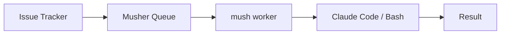

# Mush

[](https://github.com/musher-dev/mush/actions/workflows/ci.yml)
[](https://github.com/musher-dev/mush/releases)
[](https://go.dev/)
[](./LICENSE)

Local worker runtime for the [Musher](https://musher.dev) platform.


- Connects dev machines to the Musher job queue via long-polling
- Executes jobs locally using Claude Code (PTY) or Bash harnesses
- Interactive watch UI with live output, copy mode, and graceful interrupt handling
- Manages versioned agent bundles (pull, install, load)
- Built-in diagnostics, self-update, and shell completions

## Installation

```bash
curl -fsSL https://get.musher.dev | sh
```

<details>
<summary>Other install methods</summary>

```bash
# Install a specific version
curl -fsSL https://get.musher.dev | sh -s -- --version <version>

# Install and also install tmux if missing
curl -fsSL https://get.musher.dev | sh -s -- --install-tmux

# From source
go install github.com/musher-dev/mush/cmd/mush@latest
```

</details>

## Quick Start

```bash
mush init              # Guided setup (authenticates + validates)
mush habitat list      # View available habitats
mush worker start      # Start processing jobs
```

Run `mush doctor` to verify your setup at any time.

## Commands

Mush uses noun-verb command structure. Run `mush <command> --help` for details.

### Core

```
mush init                      Guided onboarding wizard
mush doctor                    Run diagnostic checks
mush update                    Update to the latest version
mush version                   Show version information
mush completion <shell>        Generate shell completion scripts
```

### Worker

```
mush worker start                      Start the worker and process jobs
mush worker start --habitat <slug>     Connect to specific habitat
mush worker start --harness <type>     Use a specific harness (claude or bash)
mush worker start --dry-run            Verify connection without claiming jobs
mush worker status                     Show worker status
mush worker stop                       Gracefully disconnect
```

### Resources

```
mush habitat list              List available habitats

mush auth login                Authenticate with your API key
mush auth status               Show authentication status
mush auth logout               Clear stored credentials

mush config list               List configuration
mush config get <key>          Get configuration value
mush config set <key> <value>  Set configuration value
```

### History

```
mush history list              List stored transcript sessions
mush history view <id>         View transcript events for a session
mush history prune             Delete sessions older than a duration
```

### Bundles

```
mush bundle load <slug>        Load a bundle into an ephemeral session
mush bundle install <slug>     Install bundle assets into the current project
mush bundle list               List local bundle cache and installed bundles
mush bundle info <slug>        Show local details for a bundle
mush bundle uninstall <slug>   Remove installed bundle assets
```

Bundle resolution goes through `/api/v1/bundles:resolve` and uses returned registry credentials for OCI pulls. If none are returned, Mush falls back to your local OCI keychain.

## Watch Controls

When running `mush worker start` in watch mode:

- `Ctrl+C` during an active Claude job: first press sends interrupt to Claude; second press within 2s exits watch mode.
- `Ctrl+C` while idle: exits watch mode immediately.
- `Ctrl+Q`: exits watch mode immediately.
- `Ctrl+S`: toggles copy mode (`Esc` returns to live input).

## Configuration

Mush looks for configuration in this order (highest priority first):

1. **CLI flags** (`--api-url`, global)
2. **Environment variables** (`MUSH_API_KEY`, `MUSH_API_URL`, `MUSH_*`)
3. **OS Keyring** (credentials only)
4. **Config file** (`<user config dir>/mush/config.yaml`)
5. **Built-in defaults**

```yaml
api:
  url: https://api.musher.dev
worker:
  poll_interval: 30
  heartbeat_interval: 30
```

See [Configuration and Data Storage](docs/configuration.md) for all config keys, environment variables, file locations, credential storage details, and global flags.

### Global flags

Use `--api-url` to override the platform API endpoint for a single command invocation:

```bash
mush --api-url https://api.staging.musher.dev worker start --dry-run
mush --api-url http://localhost:8080 doctor
```

`--api-url` takes precedence over `MUSH_API_URL` and `api.url` from config for that process.

`--api-key` is not a global flag. It is available as `mush auth login --api-key ...`, and `MUSH_API_KEY` is preferred for non-interactive usage.

## How It Works



1. **Authenticate** — Mush authenticates with the Musher platform
2. **Select Habitat** — Choose an execution context for job routing
3. **Link** — Mush links to the habitat and polls for jobs
4. **Claim** — When a job is available, Mush claims it (acquires a lease)
5. **Execute** — Jobs run in an interactive watch UI (Claude via PTY; Bash via subprocess)
6. **Heartbeat** — While executing, Mush sends heartbeats to maintain the lease
7. **Complete** — Results are reported back to the platform

## Contributing

See [CONTRIBUTING.md](./CONTRIBUTING.md) for development setup, code style, and testing.
Architecture details are in [CLAUDE.md](./.claude/CLAUDE.md).

## License

MIT License — Copyright (c) 2026 musher-dev. See [LICENSE](./LICENSE).
